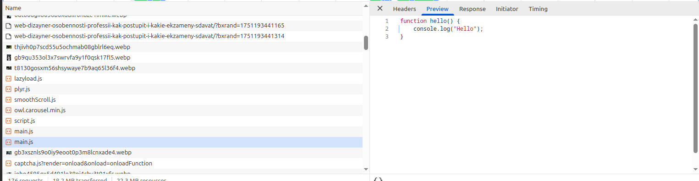

# Chrome DevTools

## Network

Для начала нужно сохранить профиль HAR с контентом, это будет файл `kmept.ru.har`, находящийся в этом же репозитории

Перейдём к проверке

1. Были найдены два ресурса, которые полностью повторяют содержимое друг друга:

2. Куча запросов к капче с одинаковым response

3. Делать запрос для файла js, в котором содержится только `console.log("Hello")` слегка странно, кому могла бы понадобиться такая функция?

4. Эти логотипы даже не отличаются размером, что уж тут говорить про их разрешение в png, стоило бы использовать webp

5. Запросы с ответом в 0 bytes

## Performance

Сохраним trace.json после того как записали его на вкладке Performance

Время от начала навигации до событий:

 - Nav - LCP: 719.37ms
 - Nav - FCP: 369.30ms
 - Nav - DCL: 620.73ms
 - Nav - Load: 1.63s

LCP - сообщение о куках

DOM-элемент параграф 

Измерить, сколько времени в миллисекундах тратится на разные этапы обработки документа (Loading, Scripting, Rendering, Painting)

Loading - 25ms
Scripting - 696ms
Rendering - 165ms
Painting - 41ms

## Coverage

Скриншот вкладки:

Размер неиспользованного JS:
Размер неиспользованного CSS
